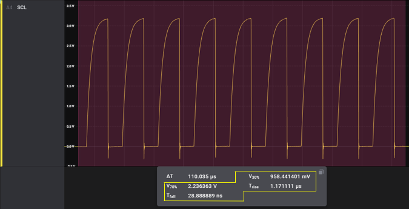
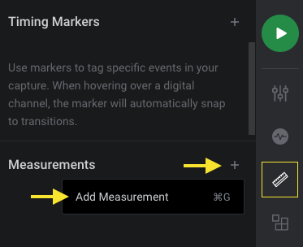

# Rise/Fall Time
  
An extension that adds average 30%-70% rise/fall time metrics to analog measurements.

## Instructions
1. Install this extension by clicking "Install"
2. Add a measurement by clicking on the "Annotations panel" on the right, then the Measurements "+" icon.

3. Drag the measurement selection window over your recorded data.